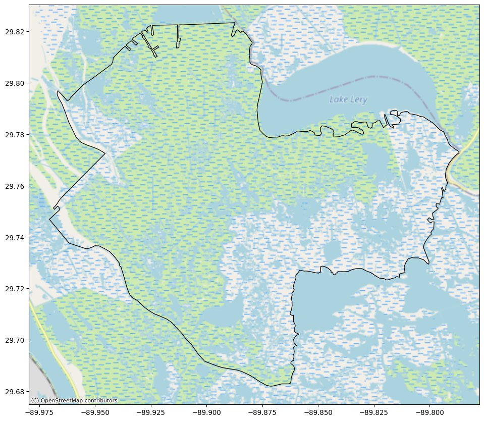
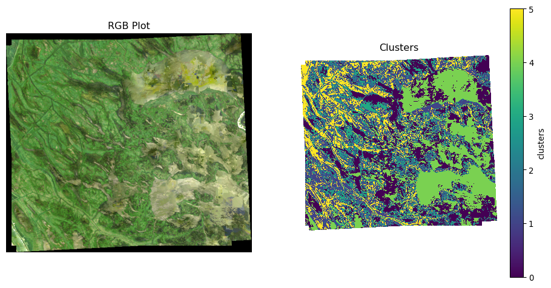

# Land cover classification at the Mississppi Delta

In this notebook, you will use a k-means **unsupervised** clustering
algorithm to group pixels by similar spectral signatures. **k-means** is
an **exploratory** method for finding patterns in data. Because it is
unsupervised, you do not need any training data for the model. You also
cannot measure how well it "performs" because the clusters will not
correspond to any particular land cover class. However, we expect at
least some of the clusters to be identifiable as different types of land
cover.

You will use the [harmonized Sentinal/Landsat multispectral
dataset](https://lpdaac.usgs.gov/documents/1698/HLS_User_Guide_V2.pdf).
You can access the data with an [Earthdata
account](https://www.earthdata.nasa.gov/learn/get-started) and the
[`earthaccess` library from
NSIDC](https://github.com/nsidc/earthaccess):

## STEP 1: SET UP

The code for a caching **decorator** is in
[landmapy/cached.py](https://github.com/byandell-envsys/landmapy/blob/main/landmapy/cached.py),
which you can use in your code. This decorator will **pickle** the
results of running a `do_something()` function, and only run the code if
the results do not already exist. To override the caching, for example
temporarily after making changes to your code, set `override=True`. Note
that to use the caching decorator, you must write your own function to
perform each task. See examples in
[landmapy/delta.py](https://github.com/byandell-envsys/landmapy/blob/main/landmapy/delta.py)
and
[landmapy/reflectance.py](https://github.com/byandell-envsys/landmapy/blob/main/landmapy/reflectance.py).

::: {.cell execution_count="1"}
``` {.python .cell-code}
# pip install --quiet ~/Documents/GitHub/landmapy
```
:::

::: {.cell execution_count="2"}
``` {.python .cell-code}
from landmapy.initial import robust_code

robust_code()
```
:::

**Watch out for override=True or False with \`@cached().**

## STEP 2: STUDY SITE

For this analysis, you will use a watershed from the [Water Boundary
Dataset](https://www.usgs.gov/national-hydrography/access-national-hydrography-products),
HU12 watersheds (`W`BDHU12.shp\`).

-   Download the Water Boundary Dataset for region 8 (Mississippi)
-   Select watershed `080902030506`
-   Generate a site map of the watershed

Try to use the **caching decorator**.

::: {.cell execution_count="3"}
``` {.python .cell-code}
from landmapy.delta import read_delta_gdf
from landmapy.plot import plot_delta_gdf
```
:::

:::: {.cell execution_count="4"}
``` {.python .cell-code}
delta_gdf = read_delta_gdf()
plot_delta_gdf(delta_gdf)
```

::: {.cell-output .cell-output-display}

:::
::::

Alternative HV plot:

    from landmapy.hvplot import hvplot_delta_gdf
    hvplot_delta_gdf(delta_gdf)

We chose this watershed because it covers parts of New Orleans and is
near the Mississippi Delta. Deltas are boundary areas between the land
and the ocean, and as a result tend to contain a rich variety of
different land cover and land use types.

Write a 2-3 sentence **site description** (with citations) of this area
that helps to put your analysis in context.

**YOUR SITE DESCRIPTION HERE**

## STEP 3: MULTISPECTRAL DATA

Build a GeoDataFrame, which will allow you to plot the downloaded
granules to make sure they line up with your shapefile. You could also
use a DataFrame, dictionary, or a custom object to store this
information.

-   [Unified Metadata Model
    (UMM)](https://www.earthdata.nasa.gov/about/esdis/eosdis/cmr/umm)
-   For each search result:
    -   Get the following information (HINT: look at the \['umm'\]
        values for each search result):
        -   granule id (UR)
        -   datetime
        -   geometry (HINT: check out the
            [shapely.geometry.Polygon](https://shapely.readthedocs.io/en/2.0.6/reference/shapely.Polygon.html)
            class to convert points to a Polygon)
    -   Open the granule files. Open one granule at a time with
        `earthaccess.open([result]`.
    -   For each file (band), get the following information:
        -   file handler returned from `earthaccess.open()`
        -   tile id
        -   band number
-   Compile all the information you collected into a GeoDataFrame.

### Open, crop, and mask data

This will be the most resource-intensive step. Cache results using the
`cached` decorator. I also recommend testing this step with one or two
dates before running the full computation. Consider a function for
opening a single masked raster, applying the appropriate scale parameter
and cropping.

-   For each granule:
    -   Open the Fmask band, crop, and compute a quality mask for the
        granule. You can use the following code as a starting point,
        making sure that `mask_bits` contains the quality bits you want
        to consider:
-   For each band that starts with 'B':
    -   Open the band, crop, and apply the scale factor
    -   Name the DataArray after the band using the `.name` attribute
    -   Apply the cloud mask using the `.where()` method
    -   Store the DataArray in your data structure (e.g. adding a
        `GeoDataFrame` column with the `DataArray` in it. Note that you
        will need to remove the rows for unused bands)

::: {.cell execution_count="5"}
``` {.python .cell-code}
from landmapy.reflect import compute_reflectance_da, merge_and_composite_arrays
```
:::

This is probably overkill, since we are already caching with pickle.

:::: {.cell execution_count="6"}
``` {.python .cell-code}
%store -r reflectance_da_df
try:
    reflectance_da_df
except NameError:
    from landmapy.earthaccess import search_earthaccess
    results = search_earthaccess(delta_gdf, ("2023-05", "2023-09"))
    reflectance_da_df = compute_reflectance_da(results, delta_gdf)
    %store reflectance_da_df
    print("reflectance_da_df created and stored")
else:
    print("reflectance_da_df retrieved from StoreMagic")
```

::: {.cell-output .cell-output-stdout}
    reflectance_da_df retrieved from StoreMagic
:::
::::

### Merge and Composite Data

You will notice for this watershed that:

1.  The raster data for each date are spread across 4 granules
2.  Any given image is incomplete because of clouds

-   For each band:
    -   For each date:
        -   Merge all 4 granules
        -   Mask any negative values created by interpolating from the
            nodata value of `-9999` (`rioxarray` should account for
            this, but does not appear to when merging. If you leave
            these values in they will create problems down the line.)
    -   Concatenate the merged DataArrays along a new date dimension
    -   Take the mean in the date dimension to create a composite image
        that fills cloud gaps
    -   Add the band as a dimension, and give the DataArray a name
-   Concatenate along the band dimension

:::: {.cell execution_count="7"}
``` {.python .cell-code}
%store -r reflectance_da
try:
    reflectance_da
except NameError:
    reflectance_da = merge_and_composite_arrays(reflectance_da_df)
    %store reflectance_da
    print("reflectance_da created and stored")
else:
    print("reflectance_da retrieved from StoreMagic")
```

::: {.cell-output .cell-output-stdout}
    reflectance_da retrieved from StoreMagic
:::
::::

:::: {.cell execution_count="8"}
``` {.python .cell-code}
reflectance_da.shape
```

::: {.cell-output .cell-output-display execution_count="21"}
    (10, 556, 624)
:::
::::

## STEP 4: K-MEANS

Looking at this with KS section The `reflectance_da` has `Band` (10
levels), `x,y`. See HLS user guide (look under module) Table 6. Bands
10,11 are thermal and in different units. Reflectance are scaled 0-1.

-   account for different scales
-   or drop these bands (preferred here)

Steps:

-   remove bands 10,11
-   take care of NAs
-   reshape

Cluster your data by spectral signature using the k-means algorithm.

-   Convert your DataArray into a **tidy** DataFrame of reflectance
    values (hint: check out the `.to_dataframe()` and `.unstack()`
    methods)
-   Filter out all rows with no data (all 0s or any N/A values)
-   Fit a k-means model. You can experiment with the number of groups to
    find what works best.

::: {.cell execution_count="9"}
``` {.python .cell-code}
from landmapy.reflect import reflectance_kmeans, reflectance_range
```
:::

::: {.cell execution_count="10"}
``` {.python .cell-code}
model_df = reflectance_kmeans(reflectance_da)
```
:::

:::: {.cell execution_count="11"}
``` {.python .cell-code}
# Check ranges.
reflectance_range(model_df)
```

::: {.cell-output .cell-output-display execution_count="24"}
<div>
<style scoped>
    .dataframe tbody tr th:only-of-type {
        vertical-align: middle;
    }

    .dataframe tbody tr th {
        vertical-align: top;
    }

    .dataframe thead th {
        text-align: right;
    }
</style>

             min      max
  ---------- -------- ---------
  band                
  1          0.0005   0.35600
  2          0.0040   0.38640
  3          0.0177   0.46760
  4          0.0134   0.49400
  5          0.0016   0.57895
  6          0.0018   0.49960
  7          0.0017   0.35720
  9          0.0003   0.00335
  clusters   0.0000   5.00000

</div>
:::
::::

## STEP 5: PLOT

Create a plot that shows the k-means clusters next to an RGB image of
the area. You may need to brighten your RGB image by multiplying it by
10. The code for reshaping and plotting the clusters is provided for you
below, but you will have to create the RGB plot yourself!

So, what is `.sortby(['x', 'y'])` doing for us? Try the code without it
and find out.

Notes on RGB plot. Uses `.sel()` method to select bands (see HLS user
guide for band numbers). Use `.rgb()` method to plot. But numbers are
0-1 and need to be 8-bit integers; rescale to 0-255. Use `.astype()`
method to convert type and `.where(rgb!=np.nan)` method to drop NAs

::: {.cell execution_count="12"}
``` {.python .cell-code}
from landmapy.reflect import reflectance_rgb
from landmapy.plot import plot_cluster

rgb_sat = reflectance_rgb(reflectance_da)
```
:::

:::: {.cell execution_count="13"}
``` {.python .cell-code}
plot_cluster(rgb_sat, model_df)
```

::: {.cell-output .cell-output-display}
{#fig-cluster}
:::
::::

Above is not perfect. Alternative HV plot:

    from landmapy.hvplot import hvplot_cluster
    hvplot_cluster(rgb_sat, model_df)

Interpret your plot.

**YOUR PLOT HEADLINE AND DESCRIPTION HERE**
